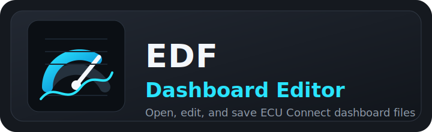

  

# EDF Dashboard Editor

This repository contains a browser-based editor for ECU Connect dashboard files.

This is an unofficial community tool. It is not affiliated with, sponsored by, or endorsed by EcuTek Technologies Ltd. EcuTek and ECU Connect are trademarks of their respective owner.

- Editor file: `EDF_Dashboard_Editor.html`
- Current revision: `2.1.1`
- Dashboard file type: `.edf`

The editor is not made for only one device model or mobile platform. It creates ECU Connect dashboard files that can be used on supported devices, as long as the dashboard matches the vehicle and screen layout you plan to use.

No example dashboard is required. Users can open their own `.edf` files or create a new dashboard from the editor.

## Quick Start

1. Open `EDF_Dashboard_Editor.html` in a desktop browser such as Chrome or Edge.
2. Click `Open EDF` to edit an existing dashboard, or start with a new one.
3. Choose the correct vehicle in the vehicle dropdown.
4. Set the dashboard orientation and size for the device/layout you want to use.
5. Add or edit widgets, pages, colors, and warning thresholds.
6. Click `Save EDF`.
7. Review the save report.
8. Copy or share the saved `.edf` to the device.
9. Open or import the `.edf` with ECU Connect.

For normal use, the user only needs the HTML editor and their `.edf` dashboard files.

## The Most Important Rule

The dashboard must match the vehicle ECU Connect has registered.

ECU Connect checks the dashboard's `VehicleId`. This is separate from the visible dashboard name. A dashboard can be perfectly valid but still show as the wrong vehicle if the `VehicleId` does not match what ECU Connect detected from the car.

Best practice:

- Connect ECU Connect to the car first.
- Let the app detect/register the vehicle.
- Choose the matching vehicle in the editor.
- Save the dashboard after that vehicle is selected.

If the app has never connected to that vehicle/revision, a custom dashboard may import but not appear as usable for that car.

## Screen Size And Orientation

Every EDF stores its own dashboard size and orientation.

The important settings are:

- Orientation: `Portrait` or `Landscape`
- Width
- Height

Use the real size of the device layout where the dashboard will be used. Do not use the size of the desktop browser window unless that is actually the target display size.

Simple rule:

- Landscape dashboards should be wider than tall.
- Portrait dashboards should be taller than wide.
- If one dashboard is meant for different device layouts, save separate EDF files for those layouts.

## Fit Mode

The editor has a `Fit` option for the canvas.

`Fit` only changes how the dashboard looks inside the editor. It makes a large dashboard easier to edit without scrolling around the browser.

It does not change the saved EDF size.

Use `Fit` for editing comfort. Use the dashboard size controls when you want to change the actual saved dashboard size.

## Resizing A Dashboard

When you change dashboard size or orientation, the editor asks how to resize it.

`Canvas only`

- Changes the saved dashboard size.
- Keeps widgets mostly where they already are.
- Best when you want to rearrange the layout yourself.

`Scale widgets`

- Changes the saved dashboard size.
- Scales widget positions and sizes into the new layout.
- Best when adapting a finished dashboard to another device layout.

After resizing, check the dashboard visually before saving.

## Save Report

When you click `Save EDF`, the editor shows a compatibility report.

Errors must be fixed before saving.

Warnings mean the file can still be saved, but something may not work well in ECU Connect.

Common warnings include:

- The vehicle does not match the known list.
- A widget is outside the dashboard area.
- A widget may be too small.
- A parameter is unknown for the selected vehicle.

After saving, the editor also shows a short summary with the vehicle, size, page count, and widget count.

## Widgets

The editor supports the ECU Connect dashboard widget types:

- Gauge
- Bar
- Vertical Bar
- Text
- Text Digital
- LED
- Chart
- Start/Stop Button
- Add Mark Button

The editor only shows controls that apply to the selected widget type. For example, `Show Peak` only appears on widgets that support peak display.

## Parameters

Widgets that show live data need a parameter.

A parameter usually includes:

- Name
- Unit
- Read method
- ECU type

Use the `Pick` button when choosing a parameter. The picker is filtered by the selected vehicle and helps avoid names that ECU Connect may not recognize.

The editor still lets older or custom parameter names stay in the file so existing dashboards can be opened and saved without losing data.

If a widget imports but shows no live data, check:

- The selected vehicle
- The parameter name
- The read method
- The ECU type
- The unit

## ECU Types

For most users, the ECU type should be left as whatever the picker selected.

The supported ECU types are:

- `Ecm`
- `Tcm`
- `Abs`
- `Tpms`
- `Aux`

Do not type custom ECU names such as `Tcu` or `Bcm`. ECU Connect does not use those names in EDF dashboards.

## Thresholds And Flash

Some widgets can show warnings when a value is too low or too high.

Thresholds are available for:

- Gauge
- Bar
- Vertical Bar
- Text

Each threshold has:

- Enabled
- Value
- Type
- Flash Screen

`Flash Screen` is only used for `Alarm` thresholds. If the threshold type is `WarmingUp`, the editor hides flash because ECU Connect does not use it there.

Text Digital and LED widgets do not show threshold controls in the editor. That matches ECU Connect behavior.

## Import Checklist

Before importing into ECU Connect:

1. Connect ECU Connect to the car at least once.
2. Confirm the dashboard vehicle matches the car ECU Connect detected.
3. Confirm the orientation matches how the dashboard will be viewed.
4. Confirm the dashboard width and height match the target device/layout.
5. Make sure widgets are large enough to read and tap.
6. Save the EDF from the editor.
7. Copy or share the EDF to local storage on the device.
8. Open or import the file with ECU Connect.

## Troubleshooting

### Dashboard Imports But Shows Unknown Vehicle ID

The EDF is probably valid, but ECU Connect does not think it belongs to the currently registered vehicle.

Try this:

- Connect ECU Connect to the car first.
- Check which vehicle/revision ECU Connect detected.
- Select the matching vehicle in the editor.
- Save the EDF again.
- Re-import the newly saved file.

Do not reuse a dashboard from a different vehicle unless you intentionally change and validate the vehicle selection.

### Dashboard Looks Tiny In The Top-left

This usually means the saved dashboard size does not match the display size ECU Connect is using.

Try this:

- Set the dashboard size to the actual target display/layout size.
- Make sure the app is in the same orientation as the dashboard.
- Use `Scale widgets` if adapting an old layout to a new size.
- Use `Fit` only while editing in the browser.
- Save the EDF again and re-import it.

### Widgets Are Too Small

ECU Connect may reject or poorly display widgets that become too small after scaling.

Try this:

- Make small widgets larger.
- Avoid tiny hidden widgets.
- Keep buttons large enough to tap.
- Re-run `Save EDF` and check the report.

### Widgets Show No Live Data

The dashboard may have imported correctly, but the widget's parameter may not match the connected vehicle.

Try this:

- Select the correct vehicle.
- Use the parameter picker.
- Check the ECU type.
- Save and re-import the EDF.

## Compatibility Notes

The editor has been tested during development against ECU Connect 8.4.1 build 599 on Android and iOS, plus known working EDF dashboard files.

Compatibility may vary with future app updates, vehicle definitions, device layouts, and dashboard content.

The editor is designed to save dashboards using the expected EDF structure:

- Expected EDF ZIP layout
- Expected `Dashboard.xml` structure
- Expected widget types
- Expected vehicle ID field
- Expected ECU type names
- Expected threshold behavior
- Expected dashboard size/orientation fields

The browser preview is only an editing preview. ECU Connect is still the final display target.
